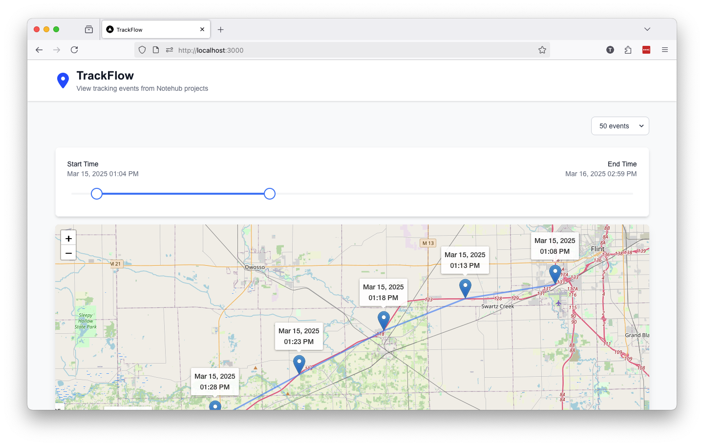

# TrackFlow

A testing app for viewing `_track.qo` Notes from Notehub projects. Learn about this project and how to use it in [Configuring Your Notecard for GPS Tracking—A Beginner’s Guide](https://dev.blues.com/blog/gps-tracking-beginner-guide).



## Requirements

To run this project you’ll need to have Node.js and npm installed. You can find the necessary steps for doing this on Windows, Mac, and Linux on [the Node.js website](https://nodejs.org/en/download).

## Environment

To run this project you’ll next need to create a local `.env` file with the following three values for the project to run successfully.

* `NOTEHUB_PROJECT_UID`: The [ProjectUID](https://dev.blues.io/api-reference/glossary/#projectuid) of your Notehub project.
* `NOTEHUB_CLIENT_ID`: The client ID you receive from [enabling programmatic API access to your Notehub project](https://dev.blues.io/api-reference/notehub-api/api-introduction/#authentication-with-oauth-bearer-tokens).
* `NOTEHUB_CLIENT_SECRET`: The client secret you receive from enabling programmatic API access to your Notehub project.

When you’re done the file should look something like this:

```plaintext
NOTEHUB_CLIENT_ID=abcd-efgh-ijkl
NOTEHUB_CLIENT_SECRET=abcdefghijk1234567890lmnopqrstuvwxyz1234
NOTEHUB_PROJECT_UID=app:1234-abcd-5678-efgh
```

## Getting Started

With Node.js installed and your `.env` file in place, open a terminal, navigate to this project’s directory, and run the following command.

```bash
npm run dev
```

This starts a local development server that runs the TrackFlow project. Open [http://localhost:3000](http://localhost:3000) with your browser to see the result.

If you want to make changes try updating the `app/page.tsx` file. The page auto-updates as you edit the file.

## Learn More

This project is built with the [Next.js](https://nextjs.org/) framework. To learn more about Next.js, take a look at the following resources:

* [Next.js Documentation](https://nextjs.org/docs) - learn about Next.js features and API.
* [Learn Next.js](https://nextjs.org/learn) - an interactive Next.js tutorial.
